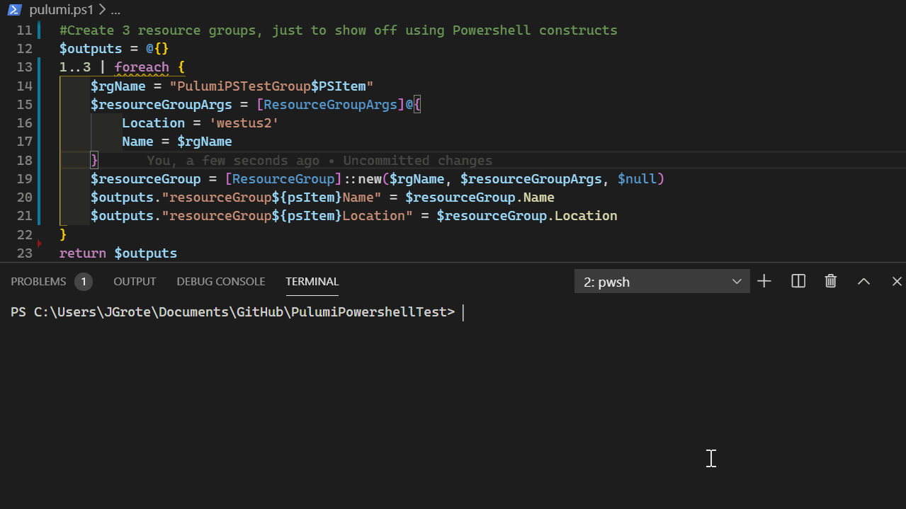

# PulumiPowershellTest
This is a proof of concept to be able to use Powershell for Pulumi. Please look at the different branches of this repository for different examples.

This requires all the same prerequisites as but does *not* need powershell preview to be installed (it will grab the runtime as part of the SDK)

pulumi.ps1 is the script that will run. You *must* return a hashtable of outputs, there is no safety checking here.

It is *very* rough, a proper implementation would use a Powershell Host, handle errors/exceptions/etc., run powershell async and stream outputs to the pulumi progress, etc.

Even better, encapsulate the pulumi process into a powershell module, that would be very tricky however as currently designed.

### Quickstart
1. Checkout the repository and switch to the directory
1. Make sure you have an Az Account configured (Connect-AzAccount or az login)
1. pulumi up (will create a test resource group in your Azure subscription if you approve)
1. Check for the 3 resource groups that should now be created in West US

